# Smart Medical Dispener

| Name           | GitHub                                                |
| -------------- | ----------------------------------------------------- |
| Nadia Dessouky | [nadiadessouky24](https://github.com/nadiadessouky24) |
| Nour Selim     | [nourselim](https://github.com/nourselim)             |

**Github Repo:** [Smart-Medical-Dispenser-Github-Link](https://github.com/nadiadessouky24/Smart-Medication-Dispenser)

# 1. The Proposal

## Abstract:

Medication non-adherence is a serious healthcare problem, particularly among elderly patients who often miss doses due to forgetfulness or lack of supervision. The Smart Medication Dispenser was proposed to fill that gap with an affordable, microcontroller-driven device that automatically dispenses pills, alerts the patient, and confirms the dose was actually taken.

The device is built around the STM32L432KC and uses a DS3231 RTC module to track time and trigger scheduled alarms. When a dose is due, an SG90 servo motor rotates a four-compartment pill wheel until the correct compartment aligns with a fixed dispensing slot, allowing the pill to drop into a collection tray. A buzzer and RGB LED then alert the patient. An IR sensor (TCRT5000) detects whether the pill was removed from the tray, and the patient presses an acknowledgment button to confirm. If no pill removal is detected within 30 seconds, the system logs the event as a missed dose with a timestamp on a 16x2 LCD over UART, giving caregivers clear visibility into adherence patterns.

To keep the system practical and self-contained, patients or caregivers can configure up to four daily dose times directly on the device using a 4×3 membrane keypad and a 16×2 LCD menu. The schedule is stored in EEPROM so it persists through power cycles.

## Project Objectives & Scope:

**Objectives:**

1. **Automate pill dispensing** — Dispense the correct compartment at up to four scheduled times daily using the STM32L432KC, with no patient intervention.

2. **Verify and log doses** — Confirm pill removal via an IR sensor and acknowledgment button. Log each dose as "taken" or "missed" with a timestamp over UART.

3. **Ensure standalone reliability** — Allow schedule configuration via a keypad and LCD. Persist data in EEPROM to survive power cycles.

**Minimal Viable Product:**

- Dispense the correct pill compartment within ±5 seconds of the scheduled time using the DS3231 RTC and SG90 servo motor.
- Alert the patient with a buzzer and RGB LED when a dose is dispensed.
- Detect pill removal using the TCRT5000 IR sensor and confirm via an acknowledgment button.
- Log each dose as "taken" or "missed" with a timestamp over UART.
- Allow configuration of up to 4 daily dose times via the 4×3 membrane keypad.
- Display status messages and menus on a 16×2 LCD (communicating over UART).
- Persist the dose schedule across power cycles using EEPROM.
- To be able to log doses taken and missed via bluetooth module on patient and/or caregiver phone. **(Stretch Goal)**

**Proposed Components:**

|      **Controller (STM32L432KC)**      |      **DS3231 RTC Module**       |     **SG90 Servo Motor**     |
| :------------------------------------: | :------------------------------: | :--------------------------: |
| 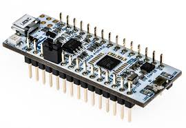 |   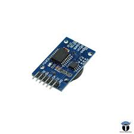   |   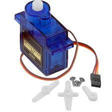   |
|          **16×2 LCD (UART)**           |      **TCRT5000 IR Sensor**      |   **4×3 Membrane Keypad**    |
|         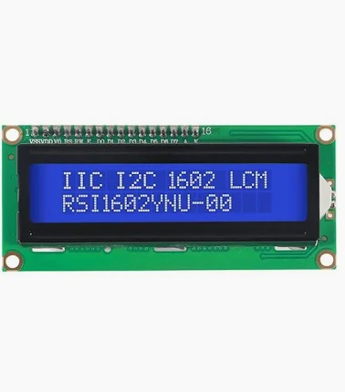         | 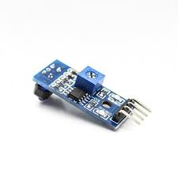 | 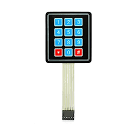 |
|               **Buzzer**               |           **RGB LED**            |  **Acknowledgment Button**   |
|      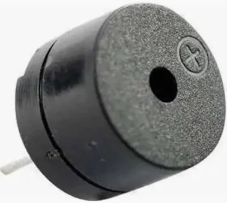      |    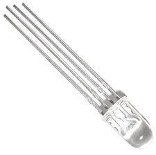    | 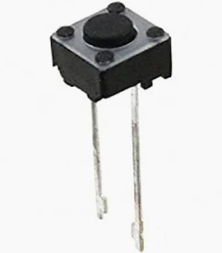 |

# 2. System Architecture

## 2.1 High-Level Block Diagram:

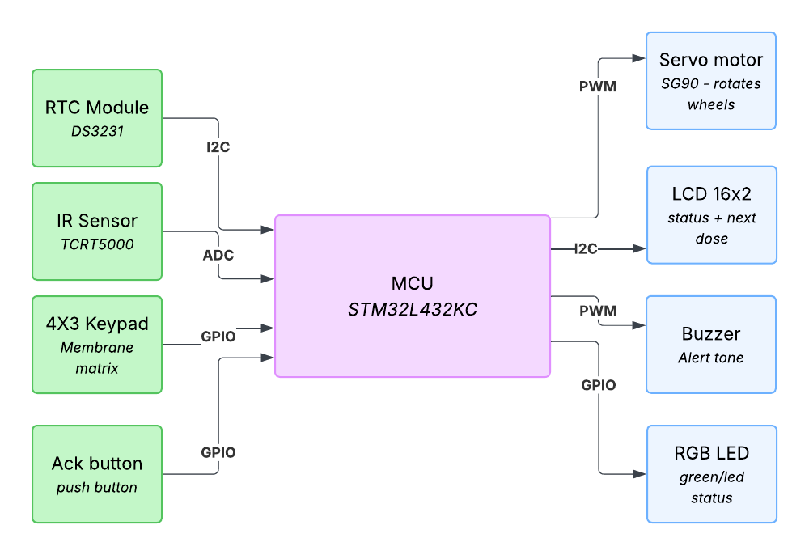

## Subsystem Breakdown:

A brief text description of how the major modules (e.g., motor control, user interface, wireless communication) interact.

# 3. Hardware Design

## Component Selection:

## Schematics & Wiring:

Circuit diagrams, pinout tables, and breadboard layouts.

## Bill of Materials (BOM):

A table listing component names, part numbers, quantities, costs, and links to datasheets.

## Power Budget:

Calculations ensuring your power supply can handle the peak current draw of all components combined.

# 4. Software Implementation

## 4.1 Software Architecture:

Description of the firmware design (e.g., Bare-metal Superloop, Interrupt-driven, or RTOS).

## 4.2 Flowcharts & State Machines:

Visual diagrams mapping out the core logic, state transitions, and interrupt service routines (ISRs).

## 4.3 Key Algorithms:

Explanations of any complex logic used (e.g., PID control loops, digital filtering, sensor fusion).

## 4.4 Development Environment:

Compilers, IDEs, and toolchains used (e.g., Keil, PlatformIO, STM32CubeIDE).

# 5. Testing, Validation & Debugging

## 5.1 Unit Testing:

How individual hardware components and software functions were tested in isolation.

## 5.2 Integration Testing:

How the system was tested as a whole.

## 5.3 Challenges & Solutions:

A log of major bugs, hardware failures, or design flaws you encountered, and the engineering steps you took to solve them.

# 6. Results & Demonstration

## 6.1 Final Prototype:

High-quality photos of the completed build.

## 6.2 Video Demonstration:

A link to a short video showing the system working in real-time under various conditions.

## 6.3 Performance Metrics:

Data showing how well the project met its initial objectives (e.g., "Response time was measured at 12ms, well within our 50ms goal").

# 7. Project Management

## 7.1 Division of Labor:

A clear breakdown of who worked on what (professors usually require this to grade individual contributions).

## 7.2 Timeline:

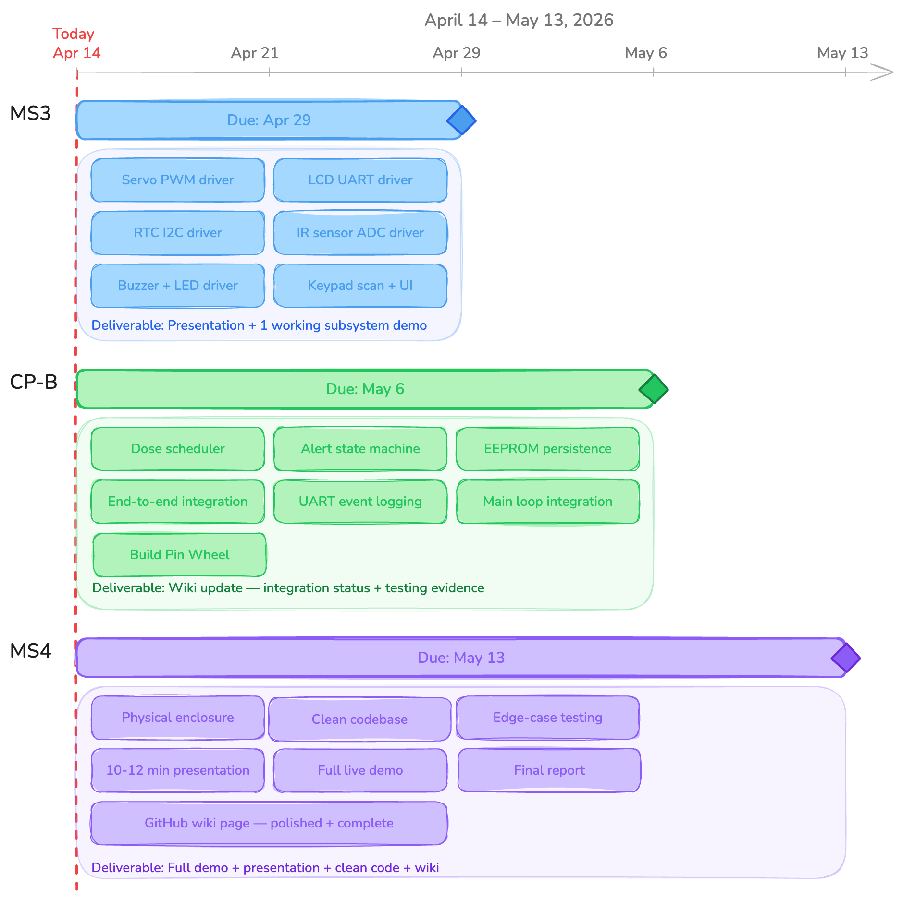

# 8. Appendices & References

## 8.1 Source Code Repository:

Link to your GitHub/GitLab repo.

## 8.2 References:

Links to datasheets, tutorials, academic papers, and course materials used during development.
